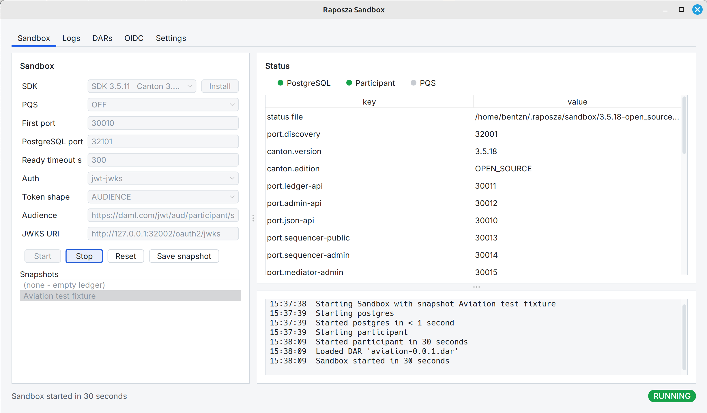
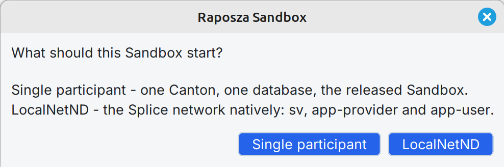
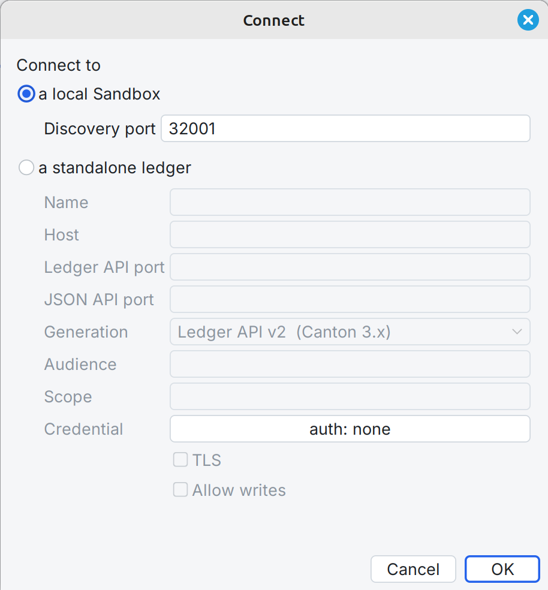
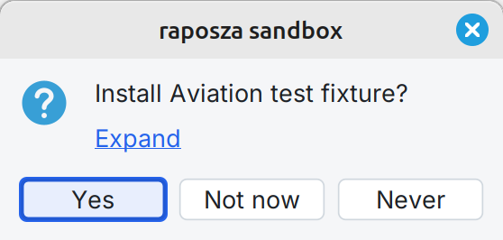
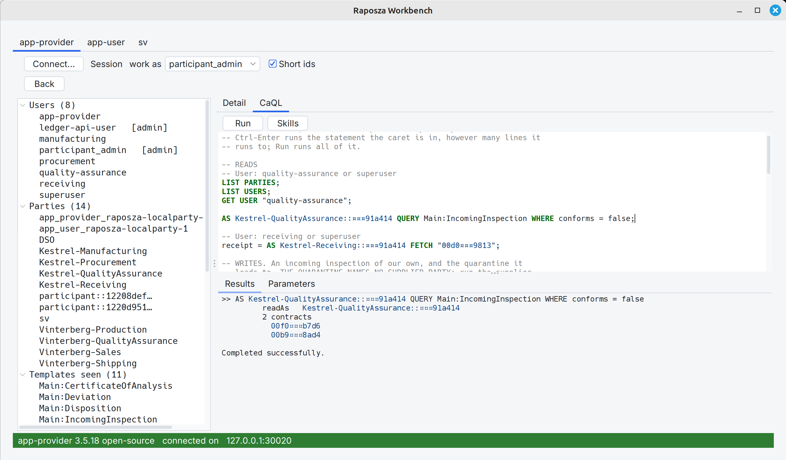
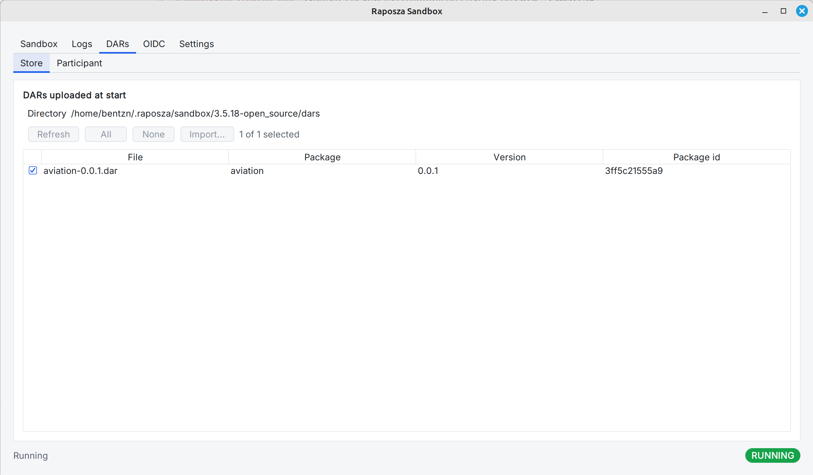
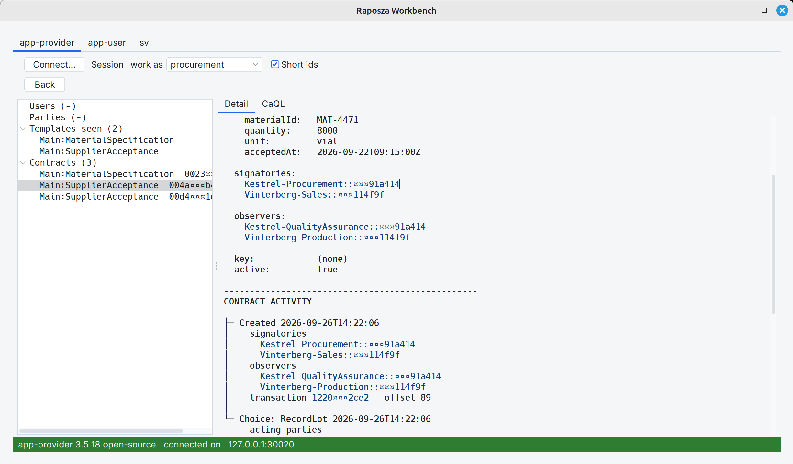
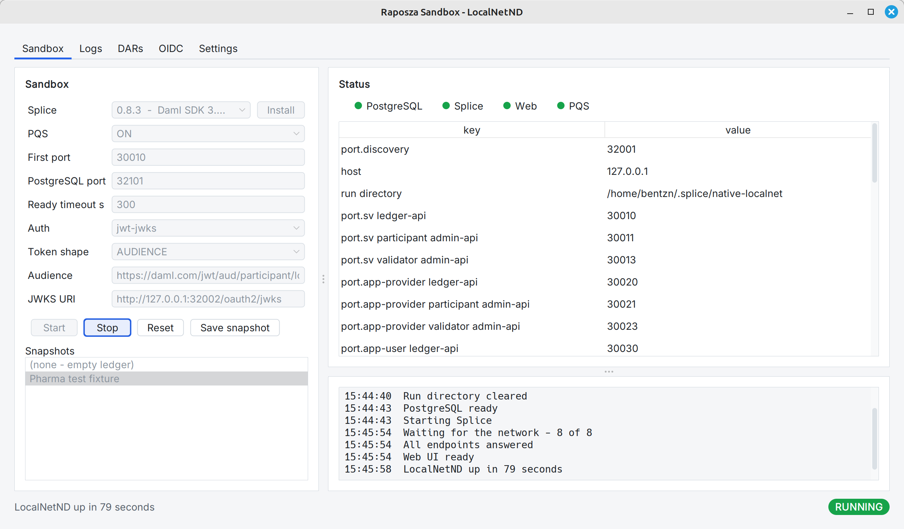
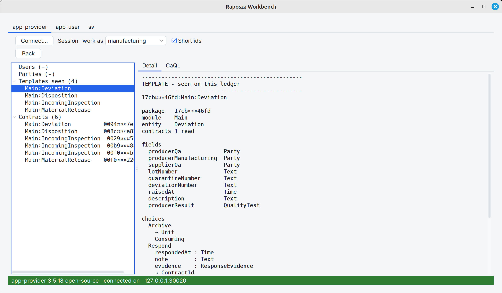
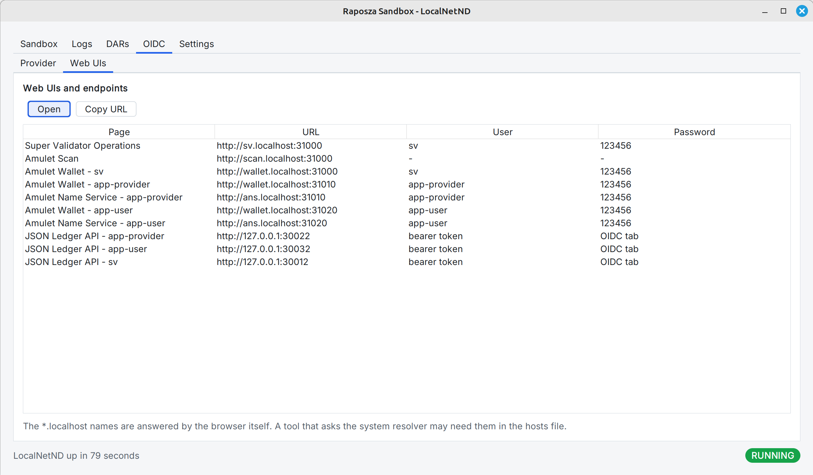

<!-- Copyright (c) 2026 bentzn -->
<!-- SPDX-License-Identifier: Apache-2.0 -->
# Raposza

Developer tooling for Canton. **Raposza Sandbox** starts a local Canton stack
as ordinary processes: one participant, or LocalNetND, a Splice network run
without containers. **Raposza Workbench** browses a ledger and runs CaQL against it.

Early, and measured per capability: `README_LONG_TIME.md` has everything else.
Licensed under Apache-2.0: see `LICENSE` and `NOTICE`.

## You need

* JDK 21
* Maven 3.9 or later
* A network route to Maven Central for the build. The Sandbox window can
  install Canton for you; that needs a route to Digital Asset's download hosts

## Download

```
git clone https://github.com/raposza/tools.git
cd tools
```

## Build

```
./build.sh                      Linux
mvn install -DskipTests         Windows
```

## Try it

```
./run-sandbox.sh --build
```

1. Choose **Single participant**.
2. If no Canton is installed, use the **Install** banner at the top of the window.
3. Press **Start**.



Then, in a second terminal:

```
./run.sh --build
```

Choose **a local Sandbox** to connect the Workbench to the Sandbox that is
running.

`./run-sandbox.sh --cli` starts the same stack in the terminal instead of the
window. `./run-sandbox.sh --help` lists every argument.

## Screenshots

| Sandbox | Workbench |
| --- | --- |
| [](docs/images/sandbox-topology.png)<br>What the Sandbox starts | [](docs/images/workbench-connect.png)<br>Connect to a local Sandbox |
| [](docs/images/sandbox-fixture-prompt.png)<br>The Aviation test fixture offered | [](docs/images/workbench-caql-pharma.png)<br>CaQL on LocalNetND, Pharma fixture |
| [](docs/images/sandbox-dars.png)<br>DARs uploaded at start | [](docs/images/workbench-contract-detail.png)<br>A contract and its activity |
| [](docs/images/sandbox-localnetnd-running.png)<br>LocalNetND running | [](docs/images/workbench-template-detail.png)<br>A template seen on the ledger |
| [](docs/images/sandbox-oidc-web-uis.png)<br>LocalNetND web UIs and endpoints | |

Details for every step, both platforms: `BUILD_AND_INSTALL.md`. Before you run
it on a shared machine, read `SECURITY.md`.
